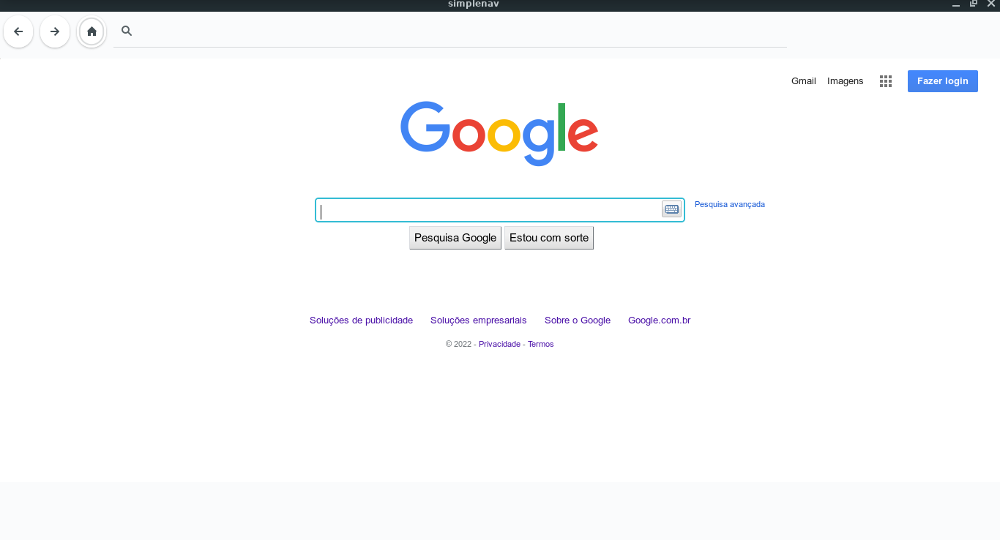

# SimpleNav

A simple navigator, without additional settings, extensions, only html to graphical interface

<h3>Installation on Linux:</h3>

make

sudo make install

<h3>Windows:</h3>

install MSYS2 to simulate linux packages

https://www.msys2.org/

Calisto – jovictor210@gmail.com

